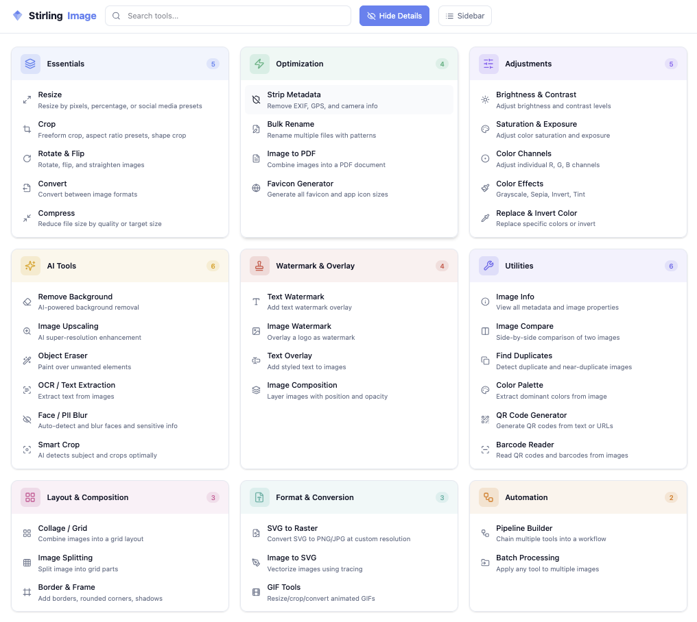

<p align="center">
  
</p>

<h1 align="center">Stirling Image</h1>

<p align="center">Stirling-PDF but for images. 30+ tools and local AI in a single Docker container.</p>

<p align="center">
  <a href="https://hub.docker.com/r/stirlingimage/stirling-image"></a>
  <a href="https://github.com/stirling-image/stirling-image/actions"></a>
  <a href="https://github.com/stirling-image/stirling-image/blob/main/LICENSE"></a>
  <a href="https://github.com/stirling-image/stirling-image/stargazers"></a>
</p>



## Key Features

- **30+ image tools** - Resize, crop, compress, convert, watermark, color adjust, and more
- **Local AI** - Remove backgrounds, upscale images, erase objects, blur faces, extract text (OCR). All running on your hardware with pre-downloaded models, no internet required
- **Pipelines** - Chain tools into reusable workflows. Batch process up to 200 images at once
- **REST API** - Every tool available via API. Interactive docs included at `/api/docs`
- **Single container** - One `docker run`, no Redis, no Postgres, no external services
- **Multi-arch** - Runs on AMD64 and ARM64 (Intel, Apple Silicon, Raspberry Pi)
- **Your data stays yours** - No telemetry, no tracking, no external calls. Images never leave your machine

## Quick Start

```bash
docker run -d -p 1349:1349 -v stirling-data:/data stirlingimage/stirling-image:latest
```

Open http://localhost:1349 in your browser.

**Default credentials:**

| Field    | Value   |
|----------|---------|
| Username | `admin` |
| Password | `admin` |

You will be asked to change your password on first login. This is enforced for all new accounts and cannot be skipped in production.

For Docker Compose, persistent storage, and other setup options, see the [Getting Started Guide](https://stirling-image.github.io/stirling-image/guide/getting-started).

## Documentation

- [Getting Started](https://stirling-image.github.io/stirling-image/guide/getting-started)
- [Configuration](https://stirling-image.github.io/stirling-image/guide/configuration)
- [REST API](https://stirling-image.github.io/stirling-image/api/rest)
- [Architecture](https://stirling-image.github.io/stirling-image/guide/architecture)
- [Developer Guide](https://stirling-image.github.io/stirling-image/guide/developer)
- [Translation Guide](https://stirling-image.github.io/stirling-image/guide/translations)

## Contributing

Contributions welcome. See [CONTRIBUTING.md](CONTRIBUTING.md) for guidelines, the [Developer Guide](https://stirling-image.github.io/stirling-image/guide/developer) for setup, and the [Translation Guide](https://stirling-image.github.io/stirling-image/guide/translations) for adding languages.

## Support

Bug reports and feature requests: [GitHub Issues](https://github.com/stirling-image/stirling-image/issues)

<!-- TODO: Add sponsorship links once Ko-fi and GitHub Sponsors are set up -->

## License

This project is dual-licensed under the [AGPLv3](LICENSE) and a commercial license.

- **AGPLv3 (free):** You may use, modify, and distribute this software under the AGPLv3. If you run a modified version as a network service, you must make your source code available under the AGPLv3. This applies to personal use, open-source projects, and any use that complies with AGPLv3 terms.
- **Commercial license (paid):** If you want to use Stirling Image in proprietary software or SaaS without the AGPLv3 source-disclosure requirement, a commercial license is available. Contact the author for pricing and terms.
